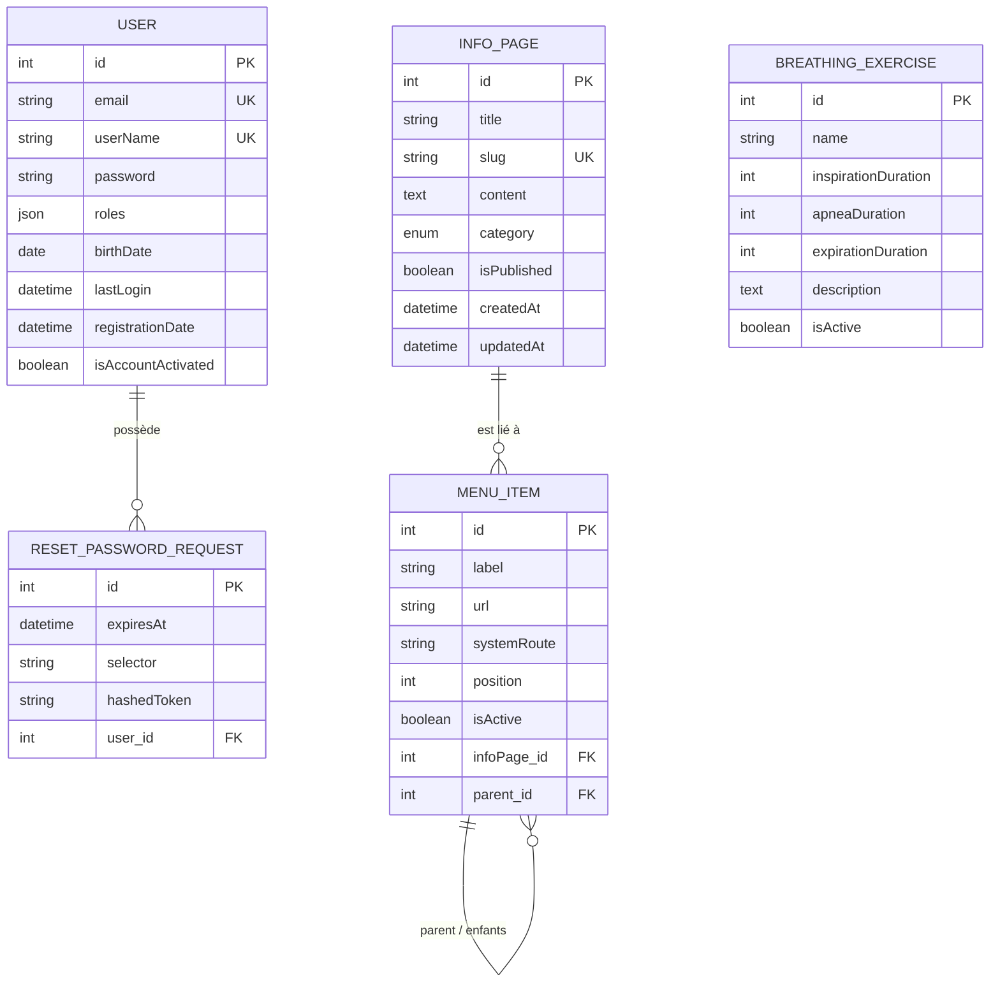

# MLD - CesiZen

## Description des tables

### USER

Représente un utilisateur de l'application. Gère l'authentification et les droits d'accès.

| Colonne              | Type        | Contrainte             | Description                                                          |
| -------------------- | ----------- | ---------------------- | -------------------------------------------------------------------- |
| `id`                 | int         | PK, auto-incrémenté    | Identifiant unique de l'utilisateur                                  |
| `email`              | string(180) | UNIQUE, NOT NULL       | Adresse email, utilisée comme identifiant de connexion               |
| `userName`           | string(255) | UNIQUE, NOT NULL       | Nom d'affichage de l'utilisateur                                     |
| `password`           | string      | NOT NULL               | Mot de passe hashé (bcrypt/argon2)                                   |
| `roles`              | json        | NOT NULL               | Tableau de rôles Symfony (ex: `["ROLE_USER"]`, `["ROLE_ADMIN"]`)     |
| `birthDate`          | date        | NOT NULL               | Date de naissance de l'utilisateur                                   |
| `lastLogin`          | datetime    | NULL                   | Date et heure de la dernière connexion                               |
| `registrationDate`   | datetime    | NOT NULL               | Date d'inscription, renseignée automatiquement à la création         |
| `isAccountActivated` | boolean     | NOT NULL, défaut: true | Indique si le compte est actif (permet de désactiver sans supprimer) |

---

### RESET_PASSWORD_REQUEST

Stocke les demandes de réinitialisation de mot de passe générées via le bundle SymfonyCasts/reset-password-bundle.

| Colonne       | Type     | Contrainte          | Description                                   |
| ------------- | -------- | ------------------- | --------------------------------------------- |
| `id`          | int      | PK, auto-incrémenté | Identifiant unique de la demande              |
| `user_id`     | int      | FK → USER, NOT NULL | Utilisateur concerné par la demande           |
| `expiresAt`   | datetime | NOT NULL            | Date d'expiration du lien de réinitialisation |
| `selector`    | string   | NOT NULL            | Identifiant public du token (partie URL)      |
| `hashedToken` | string   | NOT NULL            | Token hashé côté serveur (partie secrète)     |

---

### INFO_PAGE

Représente une page de contenu (article, page statique) gérée par les administrateurs.

| Colonne       | Type        | Contrainte              | Description                                                |
| ------------- | ----------- | ----------------------- | ---------------------------------------------------------- |
| `id`          | int         | PK, auto-incrémenté     | Identifiant unique de la page                              |
| `title`       | string(255) | NOT NULL                | Titre de la page                                           |
| `slug`        | string(255) | UNIQUE, NOT NULL        | Identifiant URL généré automatiquement depuis le titre     |
| `content`     | text        | NOT NULL                | Contenu HTML/texte de la page                              |
| `category`    | enum        | NOT NULL, défaut: PAGE  | Catégorie de la page (valeurs : `InfoPageCategory`)        |
| `isPublished` | boolean     | NOT NULL, défaut: false | Indique si la page est visible publiquement                |
| `createdAt`   | datetime    | NOT NULL                | Date de création, renseignée automatiquement               |
| `updatedAt`   | datetime    | NULL                    | Date de dernière modification, mise à jour automatiquement |

---

### MENU_ITEM

Représente un élément du menu de navigation. Supporte une hiérarchie parent/enfant et peut pointer vers une InfoPage ou une route système.

| Colonne       | Type        | Contrainte                     | Description                                         |
| ------------- | ----------- | ------------------------------ | --------------------------------------------------- |
| `id`          | int         | PK, auto-incrémenté            | Identifiant unique de l'élément                     |
| `label`       | string(255) | NOT NULL                       | Texte affiché dans le menu                          |
| `url`         | string(255) | NULL                           | URL externe (si lien vers une page externe)         |
| `systemRoute` | string(255) | NULL                           | Nom de route Symfony interne (ex: `app_home`)       |
| `position`    | int         | NOT NULL, défaut: 0            | Ordre d'affichage parmi les éléments du même niveau |
| `isActive`    | boolean     | NOT NULL, défaut: true         | Indique si l'élément est affiché dans le menu       |
| `infoPage_id` | int         | FK → INFO_PAGE, NULL, SET NULL | Page liée (si lien vers une InfoPage)               |
| `parent_id`   | int         | FK → MENU_ITEM, NULL, CASCADE  | Élément parent (null = élément racine)              |

---

### BREATHING_EXERCISE

Représente un exercice de respiration guidée avec ses durées de phases.

| Colonne               | Type        | Contrainte             | Description                                         |
| --------------------- | ----------- | ---------------------- | --------------------------------------------------- |
| `id`                  | int         | PK, auto-incrémenté    | Identifiant unique de l'exercice                    |
| `name`                | string(255) | NOT NULL               | Nom de l'exercice (ex: "Cohérence cardiaque")       |
| `inspirationDuration` | int         | NOT NULL, défaut: 0    | Durée de la phase d'inspiration (en secondes)       |
| `apneaDuration`       | int         | NOT NULL, défaut: 0    | Durée de la phase d'apnée / rétention (en secondes) |
| `expirationDuration`  | int         | NOT NULL, défaut: 0    | Durée de la phase d'expiration (en secondes)        |
| `description`         | text        | NULL                   | Description et instructions de l'exercice           |
| `isActive`            | boolean     | NOT NULL, défaut: true | Indique si l'exercice est proposé aux utilisateurs  |

---

## Relations

| Relation                          | Type | Description                                                             |
| --------------------------------- | ---- | ----------------------------------------------------------------------- |
| `USER` → `RESET_PASSWORD_REQUEST` | 1,N  | Un utilisateur peut avoir plusieurs demandes de réinitialisation        |
| `INFO_PAGE` → `MENU_ITEM`         | 1,N  | Une page peut être référencée par plusieurs éléments de menu            |
| `MENU_ITEM` → `MENU_ITEM`         | 1,N  | Auto-référence : un élément peut avoir des sous-éléments (arborescence) |
